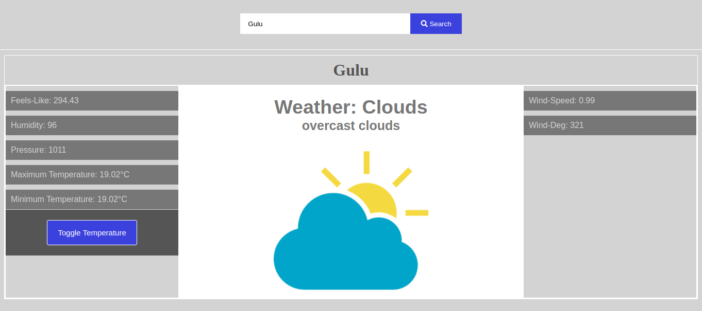

# weather-app
This projects implements using fetch method to return data from the weather api and return promises. The project also uses the try-catch block to handle scenarios where there is an error in the response from the API

## Built With

- HTML,
- CSS,
- JavaScript
- Webpack

## Live demo Link

[live link](https://rawcdn.githack.com/OdongAlican/weather-app/b1d0e5eb14c1bc473871afa73f803e2375bd3f62/dist/index.html)

### Prerequisites

- Any kind of browser supporting CSS3 and HTML5

### Setup

- Fork the repo to your remote repository.
- Clone or download the repository to your local machine.

### Usage section.
- Run `npm install`to install the project pakages
- Run `npm run dev`to bundle the packages for development. Dev is created for development, meaning that it supports hot module    replacement, dev server, and a lot of things that assist your dev work
- Run `npm run build` when you want to deploy the project for production.
- Open the `index.html`file in your browser.
- Type in a correct city or town name in the input field.
- If the input value is correct, the weather information about that city or town will be displayed.
- Feel free to change the temperature from kelvin to celcius by clicking the `Temperature toggle` Button

## Author

👤 **Odong Sunday**

- [Portfolio](https://odongsunday.netlify.app/)
- Github: [@OdongAlican](https://github.com/OdongAlican)
- Twitter: [@odongsandie](https://twitter.com/odongsandie)
- Linkedin: [Sunday Alican odong](https://www.linkedin.com/in/sunday-alican-odong/)
- [Email](mailto:sandieo.2020@gmail.com)

## 🤝 Contributing

Contributions, issues and feature requests are welcome!

Feel free to check the [issues page](https://github.com/OdongAlican/weather-app/issues).

## Show your support

Give a ⭐️ if you like this project!
